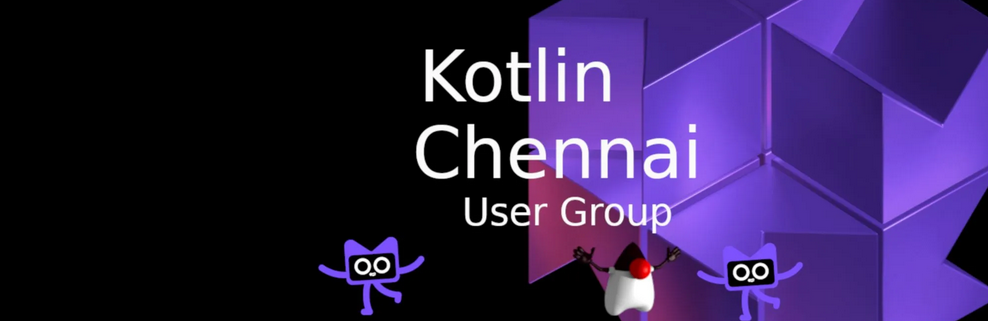

### Hi welcome to KoglinChennai 👋

The *KotlinChennai* community is an inclusive group of professionals residing in or near Chennai, dedicated to the advancement of Kotlin and Java-related technologies. We are enthusiasts of Kotlin and Java, eager to share our expertise through various monthly events such as meetups, coding dojos, hackathons, and coding challenges. Our community embraces individuals of all skill levels and backgrounds, fostering a welcoming environment for learning and collaboration. Feel free to reach out to us or to our members to get more detail of our next events. We are happy to help you to add you in our tribe.

<!--
**kotlinchennai/kotlinchennai** is a ✨ _special_ ✨ repository because its `README.md` (this file) appears on your GitHub profile.

Here are some ideas to get you started:

- 🔭 I’m currently working on ...
- 🌱 I’m currently learning ...
- 👯 I’m looking to collaborate on ...
- 🤔 I’m looking for help with ...
- 💬 Ask me about ...
- 📫 How to reach me: ...
- 😄 Pronouns: ...
- ⚡ Fun fact: ...
-->
